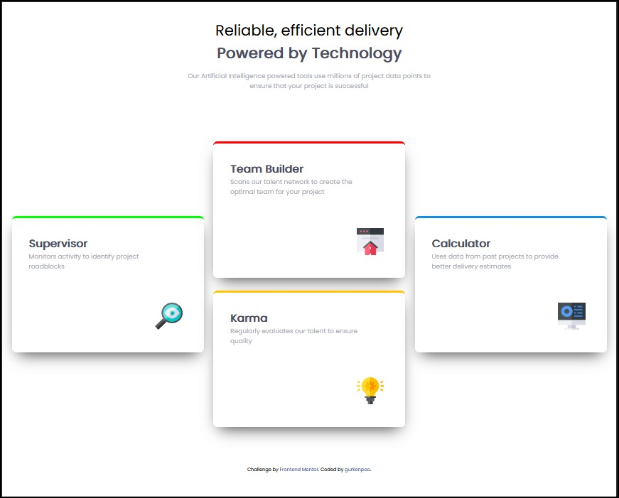

# Frontend Mentor - Four card feature section solution

This is a solution to the [Four card feature section challenge on Frontend Mentor](https://www.frontendmentor.io/challenges/four-card-feature-section-weK1eFYK). Frontend Mentor challenges help you improve your coding skills by building realistic projects. 

## Table of contents

  - [The challenge](#the-challenge)
  - [Screenshot](#screenshot)
  - [Links](#links)
  - [My process](#my-process)
  - [Built with](#built-with)
  - [What I learned](#what-i-learned)
  - [Continued development](#continued-development)
  - [Useful resources](#useful-resources)
  - [Author](#author)
  - [Acknowledgments](#acknowledgments)


### The challenge

Users should be able to:

- View the optimal layout for the site depending on their device's screen size

### Screenshot



### Links

- Solution URL: [GITHUB REPO](https://github.com/gurkenpoo/cardsStyle01)


## My process

- Starting with HTML layout and aplying Semantic markup
- Once all the HTML where structured, start configuration the styles
- applying general styles
- Make the containers first, and apply "border:" style to be more easy look it up
- start stlying the rest, such a cards, containers adding flex and wrap
- polish CSS code

### Built with

- Semantic HTML5 markup
- CSS custom properties
- Flexbox
- Desktop-first workflow

### What I learned

Using flex properties allows you to manage responsive containers, in my case, it help in the way, that i did not use MediaQueries. Using general styles is very good practice.

To see how you can add code snippets, see below:

```html
<section class="card">
      <h3 class="tituloCard">Supervisor</h3>
      <span>Monitors activity to identify project roadblocks</span>
      
    </section>
```
```css
.card {
     margin-top: 30px;
     display: flex;
     flex-direction: column;
     padding: 40px;
     border-radius: 10px;
     width: 450px;
     height: 320px;
     background-color: #ffff;
     box-shadow: 0px 17px 35px -13px rgba(0,0,0,0.75);
}
```


### Continued development

Using Cards and Boxes structures in HTML, helps me alot to understand the way it works visually. This motivate me to create an ecommerce HTML structure (only HTML and CSS for now). But i want to be able to do it.

### Useful resources

- [Border Radius visual generator](https://neumorphism.io/#e0e0e0) - This helped me for structure the radius and the shadows.
- [HTML SEMANTIC ELEMENTS](https://www.w3schools.com/html/html5_semantic_elements.asp) - This is an amazing article which helped me to never foget about the Semantic Elements (VERY GOOD PRACTICE).

## Author

- Website - [gurkenpoo](https://github.com/gurkenpoo)
- Frontend Mentor - [@gurkenpoo](https://www.frontendmentor.io/profile/gurkenpoo)
- Twitch - [@gurkenpoo](https://www.twitch.tv/gurkenpoo)

## Acknowledgments

Im not an advanced dev user, i only want to let you know that you have to make and make and make every site, every challenge to start learning and understanding more faster and safer.

